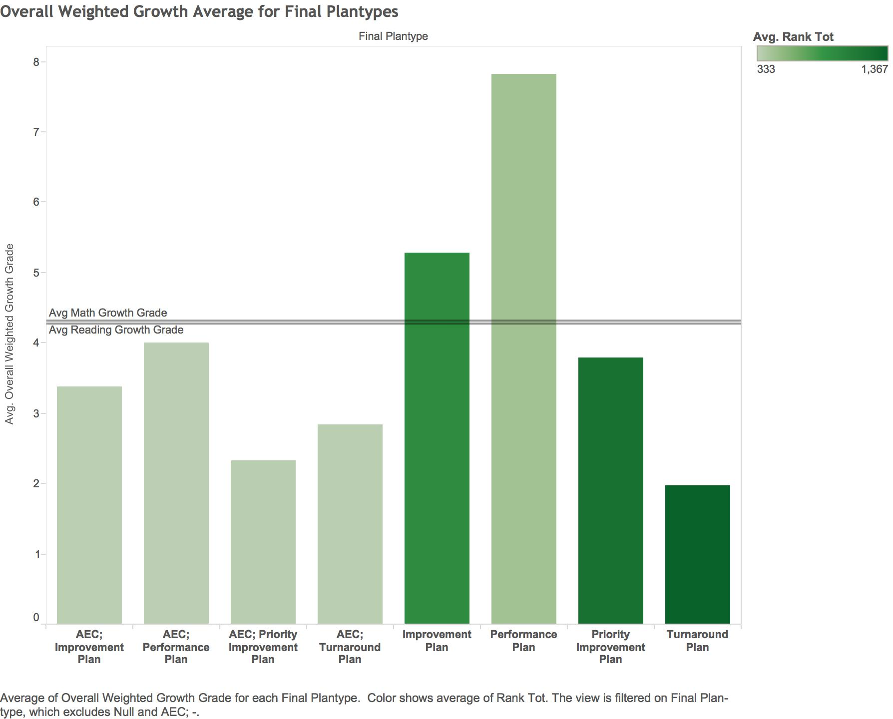

```{r, include=FALSE}
require(tidyr)
require(dplyr)
require(ggplot2)
require (jsonlite)
require (RCurl)
require (scales)
```  

##**Part 1 Extracting Data and Transforming into SQL Statement**
For our project, we extracted statistics from different A schools, Elementaries, Middle Schools, and High Schools in Colorado in 2011.  

Our table displays the different schools and their varying Math, Reading, and Writing grades as well as their growth rates.  

The code that we used to extract, transform, and load the data into an sql statement is as follows: 
```{r}
source("../01 Data/ETL.R")
```

##**Part 2 Importing into SQL and creating dataframes**
Next, we used the SQL statement and imported the data into SQL. We then took the data from SQL and put them into dataframes in R using this code below:
```{r, tidy=TRUE}
source("../01 Data/Final Grades.R",echo = TRUE)
```

##**Part 3 Creating the plots in Tableau**
Using Tableau, we extracted the data from Oracle and created three different types of plots for our dataset. 

The first plot we created was a scatter plot. 


***The final plot we created was a bar chart.***
This chart shows the overall average growth score for all of the different final plan types. Schools marked "AEC" are alternative education campuses, similar to "A" schools. These schools performed much lower than the other other schools. What's interesting is that these schools also had low rank totals (closer to 1), which means that they were ranked quite highly. Performance plans also scored the best for both AEC and regular schools.  

