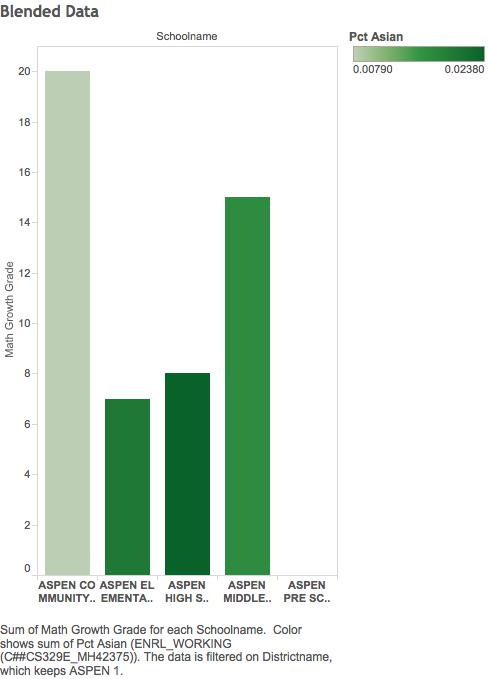

```{r, include=FALSE}
require(tidyr)
require(dplyr)
require(ggplot2)
require (jsonlite)
require (RCurl)
require (scales)
```  

##**Part 1 Extracting Data and Transforming into SQL Statement**
For our project, we extracted statistics from different A schools, Elementaries, Middle Schools, and High Schools in Colorado in 2011.  

Our table displays the different schools and their varying Math, Reading, and Writing grades as well as their growth rates.  

The code that we used to extract, transform, and load the data into an sql statement is as follows: 
```{r}
source("../01 Data/ETL.R")
```

##**Part 2 Finding additional datasets**
We used an additional table describing the different ethnic groups working at the schools with the code below.
```{r}
source("../01 Data/ETL_3.R")
```

##**Part 3 Re-creating the plots in R Studio**
Using R Studio, we extracted the data from Oracle and created three different types of plots for our dataset. 

***The first plot we created was a scatter plot.*** 
This plot shows the relationship between the School Performance Framework graduation rate and the ranking of the schools. We can see from the graph that as the ranking of the school goes up (value goes down), the graduation rate of the schools increases. The color of the graph represents different Plantypes of the different schools. We can see from the graph that there is a cluster of Performance Plan type schools near the higher ranking schools and the higher graduation rates. Thus, we can conclude from this graph that schools with the Performance Plan tend to have higher rankings as well as higher graduation rates. 

```{r, warning = FALSE}
source("../03 R SQL Visualisations/Scatter Plot.R")
```

***The second plot we created was a crosstab.***
This graph displays information concerning the district name and the type of school (A schools, elementary, middle school, high school). The colors of the crosstab are adjustable KPIs that label whether the school is a 'Great', 'Average', or 'Ok' school based on rank. Any school under the ranking of 1000 is considered 'Great'. Any school between 1000 and 10000 is considered 'Average', and all others are considered 'Ok'. We can see that most A schools and high schools tend to be in the 'Great' label, while other schools tend to vary between the three categories. 
```{r, warning=FALSE}
source("../03 R SQL Visualisations/Crosstab.R")
```

However, because our crosstab had too many results, the numbers merged together and it was difficult to read. Thus, we also created a graph that only displays the color of the KPI for each EMH and District Name. 

```{r, warning = FALSE}
source("../03 R SQL Visualisations/Crosstab_NoLabel.R")
```

***The final plot we created was a bar chart.***
This chart shows the overall average growth score for all of the different final plan types. Schools marked "AEC" are alternative education campuses, similar to "A" schools. These schools performed much lower than the other other schools. What's interesting is that these schools also had low rank totals (closer to 1), which means that they were ranked quite highly. Performance plans also scored the best for both AEC and regular schools.  
```{r, warning=FALSE}
source("../03 R SQL Visualisations/Bar Chart.R")
```

##**Part 4 Blending Data**
We blended two tables together to create new results. The tables we used consisted of the original table as well as another table depicting different ethnic groups within the school.   
  
***Tableau***   
In Tableau, we combined the two datasets connected by the school name. We filtered out the schools so that only schools in the district name: "Aspen 1" were included in the graph. Then, we looked at a bar chart of the schools in the district and their correspending math growth scores. We then colored the graph with the percentage of Asians in the schools. From the graph, we can see that the school that grew the most in math scores consisted of less Asians.   

